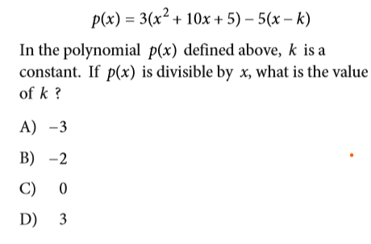

<div align="center">
   <h1>Seeker-o1 </h1>
</div>

<p align="center">
  
</p>


## Table of Contents

- [Introduction](#-introduction)
- [Why Seeker-o1?](#-why-seeker-o1)
- [Features & Capabilities](#-features--capabilities)
- [Installation](#-installation)
- [Quick Start](#-quick-start)
- [Usage Examples](#-usage-examples)
- [Documentation](#-documentation)
- [Contributing](#-contributing)
- [Community](#-community)
- [License](#-license)

## Intro

**Seeker-o1**  is a flexible open-source AI agent system. It is also an upgrade and an alternative of [@Seeker](https://github.com/iBz-04/Seeker) the deep research agent

## Demo

## video
https://github.com/user-attachments/assets/b1b68a64-425d-487a-b3bc-741f124caa1b

### Image Recognition

Add the path to your image them giving a task to the agent:

```task "solve this problem in the image" sample_images/deqn.png ```



Answer:


### Memory

The agent has both short-term and long-term memory

```below is a long term memory example```


Seeker-o1 empowers users to create AI agents that can:

- Execute tasks through natural language instructions
- Process text inputs
- Perform basic calculations
- Run code in a controlled environment


## ✨ Features & Capabilities

### AI Agent Architecture

- **Single-Agent System**: Process and execute tasks with a single agent
- **Tool Integration**: Use a variety of tools to accomplish tasks
- **Memory Management**: Basic context retention during conversation

### Current Tool Ecosystem

- **Text Processing**:
  - Character counting
  - Word counting
  - Text transformation (uppercase, lowercase, capitalize, reverse)

- **Code Execution**:
  - Python code execution
  - Output capture and analysis

- **Calculations**:
  - Basic arithmetic operations
  - Expression evaluation

###  API Integration

- **OpenAI API Support**: Seamless integration with GPT models


Seeker-o1 supports multiple installation methods to accommodate different user preferences and environments.

### Prerequisites

- Python 3.11 or higher
- pip (Python package installer)
- Git

### Installation:

```bash
# Clone the repository
git clone https://github.com/iBz-04/Seeker-o1.git
cd Seeker-o1

# Create and activate a virtual environment
python -m venv venv
source venv/bin/activate  # On Windows: venv\Scripts\activate

# Install in development mode
pip install -e .
```

### Configuration

After installation, you'll need to configure Seeker-o1 with your API keys:

1. Create a `.env` file in the project root
2. Add your API keys:

```
OPENAI_API_KEY=your_openai_api_key
```

## Quick Start

### CLI Mode

Start interactive mode:

```best & simplest Option```

In your terminal, simply type: 
```bash
seeker-o1
```

```Alternatively : ```

After installing in editable or standard mode, you can launch the Seeker-o1 CLI directly:

```bash
seeker-o1 --help
```

This displays global options. To run a one-off task:

```bash
seeker-o1 --mode multi --task "solve the math problem in this image" assets/images/equation.png
```


Once inside, use `help` or `?` to list available commands, and `task` to execute tasks.


## 📋 Usage Examples

### Basic Examples

#### Text Processing

```python
from seeker_o1.core.agent.tool_agent import ToolAgent

# Create an agent with text processing capabilities
agent = ToolAgent(tools=["text"])

# Process text
response = agent.execute("Count words in 'Hello, world!'")
print(response)
```

#### Code Execution

```python
from seeker_o1.core.agent.tool_agent import ToolAgent

# Create an agent with code execution capabilities
agent = ToolAgent(tools=["code"])

# Execute Python code
response = agent.execute("Run code ```print('Hello, world!')```")
print(response)
```

## 📖 Documentation

For more detailed information, please refer to the documentation in the `docs/` directory.

## 🤝 Contributing

We welcome contributions from the community, feel free to report issues, request features or submit pull requests!


## 📄 License

Seeker-o1 is released under the [MIT License](LICENSE).
